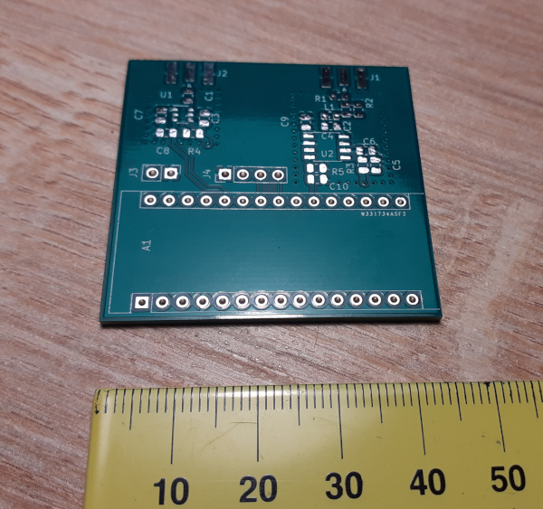
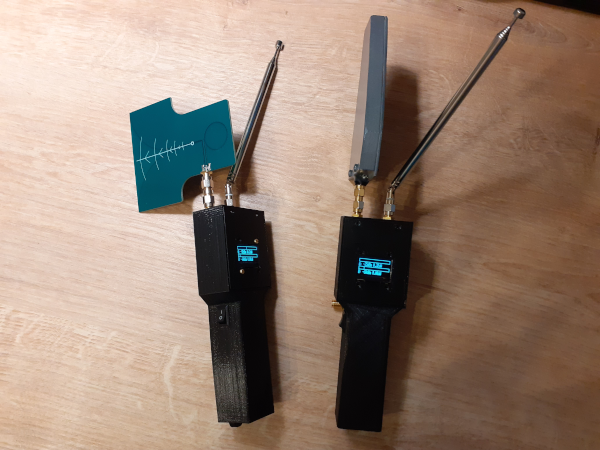
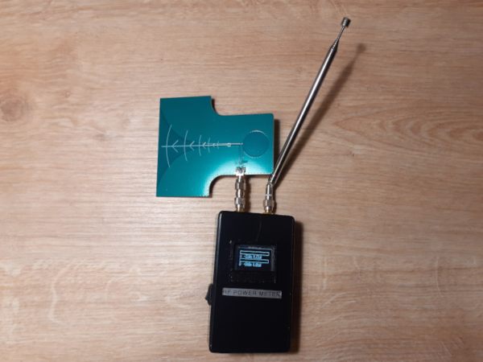

# Introduction
Dual channel Arduino Nano RF milliwatt power meter for HF/VHF/UHF/SHF bands. Can be used for different RF equipment troubleshooting, RF leakage search and antenna radiation/gain measurements and comparison.

This project is Arduino Nano clone of W1GHZ power meter adopted for use with Arduino Nano and SSD1307 OLED screen. Read more details at http://www.w1ghz.org/new/portable_powermeter.pdf. 

Unlike original meter, which is just an indicator, this device shows precise DBM values and could be calibrated, calibration table is stored in the sketch. Moreover, device takes maximum RF power value during 1 second interval, which allows signal duration measurements down to 1 ms and marks maximum value during 1 minute interval on the bar.

# Technical details
- Measurement power range from -32 up to 20 dBm on channel A and -60 up to 20 dBm on channel B
- Frequency range
  - Channel A: 300 MHz - 7 GHz, up to 12 GHz with performance degradation
  - Channel B: 10 KHz up to 300 MHz
- Minimum signal length detection about 1 ms
- Based on Arduino Nano
- Screen is [SSD1307](https://cdn-shop.adafruit.com/datasheets/SSD1306.pdf)
- UHF/SHF part (left channel A) is based [LTC5507 RF Power Detector](https://www.analog.com/media/en/technical-documentation/data-sheets/5508fa.pdf), allows measurement from 300MHz up to 7GHz and up to approximately 12 GHz with some performance degradation.
- HF/VHF part (right channel B) is based on [AD8307 Logarithmic Amplifier](https://www.analog.com/media/en/technical-documentation/data-sheets/AD8307.pdf), allows mesurement from DC up to 300 MHz
- Geiger counter style buzzer for audiable signal level indication
- Must be powered from the battery (e.g. 9V)

# Dependencies
- Arduino timer: https://github.com/contrem/arduino-timer

# Results
Sucessfully shows power values for various ISM signals, such as 5 GHz, 2.4 GHz WiFi, 433/868 MHz ISM devices and amateur radio transmissions at close range. 

At SHF band good sensitivity and results are achieved when using cheap Vivaldi antenna. 

At HF/VHF/UHF telescopic antenna performs well enough. For close board inspection EM probes could be used. 

Also, additional shield could be helpful. 

Device must be powered from the battery only, powering from PC USB will cause PC USB RFI and other noise to be measured by the device.
