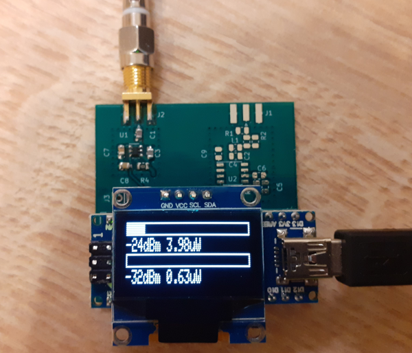

# Introduction
Dual channel Arduino Nano power milliwatt meter for HF/VHF/UHF/SHF bands. 

This project is Arduino Nano clone of W1GHZ power meter adopted for use with Arduino Nano and SSD1307 OLED screen. Read more details at http://www.w1ghz.org/new/portable_powermeter.pdf

# Technical details
- Measurement power range from -32 up to 20 dBm
- Frequency range
  - Channel A: 300 MHz - 7 GHz, up to 12 GHz with performance degradation
  - Channel B: 10 KHz up to 300 MHz
- Minimum signal length detection about 1 ms
- Based on Arduino Nano
- Screen is [SSD1307](https://cdn-shop.adafruit.com/datasheets/SSD1306.pdf)
- UHF/SHF part (left channel A) is based [LTC5507 RF Power Detector](https://www.analog.com/media/en/technical-documentation/data-sheets/5508fa.pdf), allows measurement from 300MHz up to 7GHz and up to approximately 12 GHz with some performance degradation.
- HF/VHF part (right channel B) is based on [AD8307 Logarithmic Amplifier](https://www.analog.com/media/en/technical-documentation/data-sheets/AD8307.pdf), allows mesurement from DC up to 300 MHz

